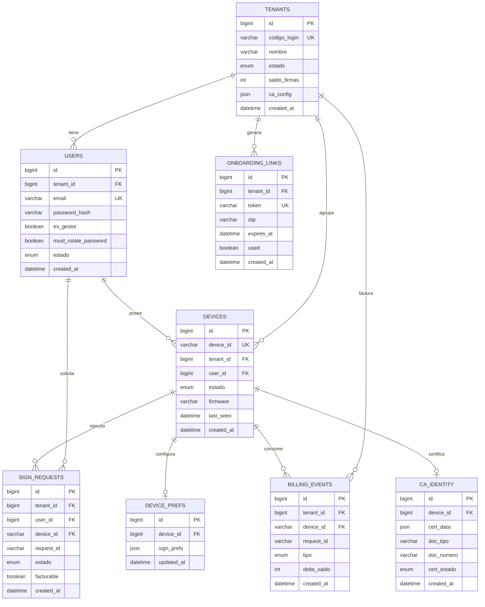

# DISEÑO — Base de datos `xami_db` (Console)

> Diseño del modelo de datos de la consola multi-tenant de Xami.
> Acompaña a `docs/DISENO_CONSOLE.md` (especificación funcional).
> Estado: DISEÑO (no implementado). Fecha: 2026-06-11.
>
> BD: `xami_db` (MySQL/MariaDB). Aislamiento multi-tenant por columna `tenant_id`.
> Motor recomendado: InnoDB (claves foráneas + transacciones). Charset utf8mb4.

---

## 1. Diagrama Entidad-Relación

---

## 2. Tablas

### 2.1 `tenants`
Clientes de xami.run. Cada fila es una organización (o un individuo gestionado
por un empleado de xami.run). Raíz del aislamiento multi-tenant.

| Columna | Tipo | Descripción | Ejemplo |
|---|---|---|---|
| id | BIGINT PK AUTO_INCREMENT | Identificador interno del tenant. | 1 |
| codigo_login | VARCHAR(32) UNIQUE | Código de login del tenant (lo crea xami.run). | `acme-corp` |
| nombre | VARCHAR(150) | Nombre legible del cliente. | `ACME Corp S.A.` |
| estado | ENUM('activo','suspendido','baja') | Estado del tenant. | `activo` |
| saldo_firmas | INT | Saldo de firmas disponible (billing). | 5000 |
| ca_config | JSON | Parámetros del CA y config general del tenant (incluye el TSA, único por tenant). | `{"ca":"uanataca","perfil":"PJ","tsa_url":"http://tsa.uanataca.com/tsa"}` |
| created_at | DATETIME | Fecha de creación. | `2026-06-11 15:00:00` |

### 2.2 `users`
Usuarios de un tenant. Un usuario pertenece a un solo tenant. El rol GESTOR es un
flag rotable (`es_gestor`). Un mismo usuario puede ser dueño de devices y, si es
gestor, además administrar el tenant.

| Columna | Tipo | Descripción | Ejemplo |
|---|---|---|---|
| id | BIGINT PK AUTO_INCREMENT | Identificador interno del usuario. | 10 |
| tenant_id | BIGINT FK -> tenants.id | Tenant al que pertenece. | 1 |
| email | VARCHAR(180) UNIQUE | Correo (login del usuario). | `ana@acme.com` |
| password_hash | VARCHAR(255) | Hash de la clave (bcrypt/argon2). Nunca texto plano. | `$2y$10$...` |
| es_gestor | BOOLEAN | Rol gestor del tenant (rotable). | `true` |
| must_rotate_password | BOOLEAN | Obliga a cambiar la clave temporal al ingresar. | `true` |
| estado | ENUM('activo','suspendido','baja') | Estado del usuario. | `activo` |
| created_at | DATETIME | Fecha de creación. | `2026-06-11 15:05:00` |

### 2.3 `devices`
Dispositivos Xami (miniHSM). Un device sirve a un solo usuario (1:1 con la
identidad de firma). Nace HUÉRFANO (sin tenant ni usuario); xami.run le asigna
tenant y el gestor lo asigna a un usuario. `tenant_id` y `user_id` son nullables
para soportar ese ciclo de vida.

| Columna | Tipo | Descripción | Ejemplo |
|---|---|---|---|
| id | BIGINT PK AUTO_INCREMENT | Identificador interno. | 30 |
| device_id | VARCHAR(32) UNIQUE | DeviceID real del miniHSM (identidad de firma). | `fe4dfede3b10c54b` |
| tenant_id | BIGINT FK -> tenants.id NULL | Tenant asignado (NULL = huérfano). | 1 |
| user_id | BIGINT FK -> users.id NULL | Usuario dueño (NULL = sin asignar). | 10 |
| estado | ENUM('huerfano','asignado_tenant','asignado_usuario','activo','inhabilitado') | Estado del ciclo de vida. | `activo` |
| firmware | VARCHAR(40) | Versión de firmware reportada en el heartbeat. | `firmware-v35` |
| last_seen | DATETIME NULL | Último heartbeat conocido (monitoreo polling). | `2026-06-11 15:18:00` |
| created_at | DATETIME | Fecha de alta en console. | `2026-06-11 15:10:00` |

### 2.4 `device_prefs`
Preferencias de firma REUTILIZABLES por device (las que el usuario configura una
vez y se aplican en cada job). Se guardan como JSON porque el set de parámetros
del sello puede evolucionar. Relación 1:1 con `devices`.

| Columna | Tipo | Descripción | Ejemplo |
|---|---|---|---|
| id | BIGINT PK AUTO_INCREMENT | Identificador interno. | 50 |
| device_id | BIGINT FK -> devices.id UNIQUE | Device al que pertenecen las prefs. | 30 |
| sign_prefs | JSON | Preferencias del sello (ver 7.2 de DISENO_CONSOLE). NO incluye el TSA: el sellado de tiempo es único por tenant y vive en `tenants.ca_config`. | `{"name":"Ana Díaz","reason":"Aprobación","visible":true,"page":1,"box":"50,50,250,130","image_mode":"left","border":true}` |
| updated_at | DATETIME | Última actualización de preferencias. | `2026-06-11 15:20:00` |

### 2.5 `ca_identity`
Datos de identidad y certificado de un device, para la ceremonia con el CA.
Incluye datos que van en el certificado (`cert_data`) y datos que NO van en el
cert pero el CA exige para identificación (cédula, tipo de documento). Relación
1:1 con `devices`. SE LLENA AL FINAL (fase CA); existe en el diseño desde ya.

| Columna | Tipo | Descripción | Ejemplo |
|---|---|---|---|
| id | BIGINT PK AUTO_INCREMENT | Identificador interno. | 70 |
| device_id | BIGINT FK -> devices.id UNIQUE | Device/identidad que se certifica. | 30 |
| cert_data | JSON | Datos que van en el certificado (según exija el CA). | `{"cn":"Ana Díaz","org":"ACME","country":"PE"}` |
| doc_tipo | VARCHAR(20) | Tipo de documento de identidad. | `DNI` |
| doc_numero | VARCHAR(30) | Número de documento (no va en el cert; lo pide el CA). | `45678912` |
| cert_estado | ENUM('pendiente','emitido','revocado') | Estado del certificado. | `pendiente` |
| created_at | DATETIME | Fecha de captura de datos. | `2026-06-11 15:25:00` |

### 2.6 `onboarding_links`
Enlaces de un solo uso (con OTP) para el onboarding del responsable del tenant.
Válidos 48h. Si caducan, el super-admin emite otro.

| Columna | Tipo | Descripción | Ejemplo |
|---|---|---|---|
| id | BIGINT PK AUTO_INCREMENT | Identificador interno. | 90 |
| tenant_id | BIGINT FK -> tenants.id | Tenant al que pertenece el enlace. | 1 |
| token | VARCHAR(64) UNIQUE | Token aleatorio del enlace (URL). | `a1b2c3...e9f0` |
| otp | VARCHAR(10) | Código OTP de un solo uso. | `483920` |
| expires_at | DATETIME | Vencimiento (created_at + 48h). | `2026-06-13 15:00:00` |
| used | BOOLEAN | Si ya fue consumido (un solo uso). | `false` |
| created_at | DATETIME | Fecha de emisión. | `2026-06-11 15:00:00` |

### 2.7 `sign_requests`
Solicitudes de firma encoladas vía console. Espejo (en la capa de console) de los
jobs que el optimizador procesa, para trazabilidad, permisos y billing. El
`request_id` referencia el job del optimizador.

| Columna | Tipo | Descripción | Ejemplo |
|---|---|---|---|
| id | BIGINT PK AUTO_INCREMENT | Identificador interno. | 200 |
| tenant_id | BIGINT FK -> tenants.id | Tenant que solicita (aislamiento/billing). | 1 |
| user_id | BIGINT FK -> users.id | Usuario que envió a firmar. | 10 |
| device_id | VARCHAR(32) FK -> devices.device_id | Device que ejecuta la firma. | `fe4dfede3b10c54b` |
| request_id | VARCHAR(48) | ID del job en el optimizador (correlación). | `a3f9c1b2d4e5` |
| estado | ENUM('pendiente','entregado','firmado','error') | Estado del trabajo. | `firmado` |
| facturable | BOOLEAN | Si esta operación descuenta saldo. | `true` |
| created_at | DATETIME | Fecha de encolado. | `2026-06-11 15:30:00` |

### 2.8 `billing_events`
Movimientos de saldo de firmas. Cada operación facturable genera un evento que
descuenta (o ajusta) el saldo del tenant. Permite auditar el consumo y comprobar
el billing.

| Columna | Tipo | Descripción | Ejemplo |
|---|---|---|---|
| id | BIGINT PK AUTO_INCREMENT | Identificador interno. | 300 |
| tenant_id | BIGINT FK -> tenants.id | Tenant afectado. | 1 |
| device_id | VARCHAR(32) NULL | Device que consumió (si aplica). | `fe4dfede3b10c54b` |
| request_id | VARCHAR(48) NULL | Operación que originó el movimiento. | `a3f9c1b2d4e5` |
| tipo | ENUM('consumo','recarga','ajuste') | Tipo de movimiento. | `consumo` |
| delta_saldo | INT | Cambio en el saldo (negativo consume, positivo recarga). | -1 |
| created_at | DATETIME | Fecha del evento. | `2026-06-11 15:30:05` |

---

## 3. Vistas / Funciones / Procedures / Índices

> Sección para registrar objetos de BD que se detecten necesarios. Por ahora solo
> índices base; el resto queda vacío para agregar cuando se implemente.

### 3.1 Índices recomendados
Más allá de los PK y UNIQUE ya declarados:
- `users (tenant_id)` — listar usuarios de un tenant (aislamiento).
- `devices (tenant_id)`, `devices (user_id)` — inventario por tenant / por dueño.
- `devices (estado)` — filtrar huérfanos, inhabilitados, activos.
- `onboarding_links (token)` — resolución del enlace (ya UNIQUE).
- `onboarding_links (expires_at)` — purga de enlaces vencidos.
- `sign_requests (tenant_id, created_at)` — actividad por días (gráficos/billing).
- `sign_requests (device_id)` — historial por device.
- `billing_events (tenant_id, created_at)` — cálculo de saldo / reportes.

### 3.2 Vistas (propuestas, no obligatorias)
- `v_device_inventory` — device + tenant + usuario + estado + last_seen, para el
  dashboard del gestor.
- `v_tenant_saldo` — saldo vigente por tenant (saldo_firmas + suma de delta_saldo).
- `v_actividad_diaria` — conteo de firmas por día/tenant (válidas vs error).

### 3.3 Funciones / Procedures
- (vacío) — Evaluar un procedure transaccional para "encolar firma + descontar
  saldo" de forma atómica cuando se defina la regla de billing (DT6).

---

## 4. Consideraciones de seguridad

1. Aislamiento multi-tenant: TODA consulta filtra por `tenant_id`. Nunca exponer
   datos sin ese filtro. El `tenant_id` se deriva de la sesión autenticada del
   usuario, jamás de un parámetro que el cliente pueda manipular.
2. Contraseñas: solo `password_hash` con bcrypt o argon2. Nunca texto plano. El
   `must_rotate_password` fuerza el cambio de la clave temporal en el primer login.
3. Onboarding: el `token` y el `otp` son de un solo uso (`used=true` tras
   consumirse) y caducan a las 48h (`expires_at`). Tokens largos y aleatorios
   (>=32 bytes). Validar SIEMPRE expiración y uso antes de aceptar.
4. console como GUARDIÁN: valida permisos contra `xami_db` ANTES de llamar al
   optimizador. La capa de datos no sustituye esa validación en la app.
5. Secretos del mini (MINIHSM_SECRET, STAMPING_API_KEY): NO se guardan en claro en
   la BD. Si console gestiona su rotación, almacenar cifrados o fuera de la BD, y
   coordinar con el ciclo de match/rotación del firmware (DT5).
6. Datos de identidad (cédula, doc_numero) y `cert_data`: son datos personales.
   Acceso restringido al propio usuario y a procesos del CA. El gestor NO debe ver
   la actividad de firma ajena (barrera de privacidad, R4).
7. Integridad referencial: usar InnoDB con claves foráneas. Definir ON DELETE con
   criterio (p. ej. no borrar tenant con usuarios; baja lógica vía `estado`).
8. Baja lógica preferente: usar `estado` ('baja'/'suspendido') en lugar de DELETE
   físico para conservar trazabilidad y auditoría de billing.
9. Inyección SQL: usar siempre consultas preparadas (PDO con parámetros). El
   `.env` de console contiene credenciales con caracteres especiales (p. ej. `~`):
   leerlo de forma robusta, no exponerlo nunca por la web (fuera del docroot o
   protegido por `.htaccess`).
10. Auditoría: `created_at` en todas las tablas; `billing_events` es el libro
    mayor del consumo. No mutar eventos de billing (solo insertar).
