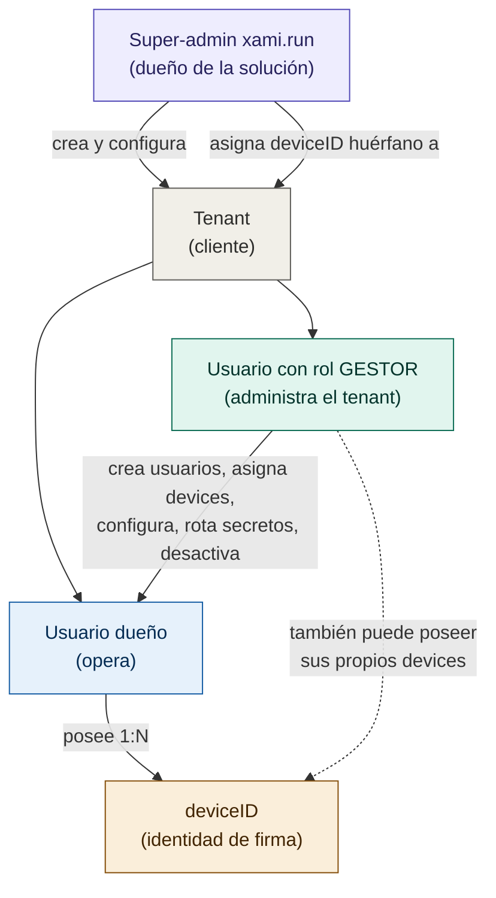

# DISEÑO — Console (panel de gestión de Xami)

> Documento de diseño de `xami.run/console/`: la consola web multi-tenant para
> gestionar dispositivos Xami (miniHSM), usuarios y firmas. Define el QUÉ y el
> POR QUÉ. La implementación se hará por fases. NO toca el firmware ni el
> optimizador (api.xami.run) salvo lo que se marque como deuda técnica.
>
> Estado: DISEÑO (no implementado). Fecha: 2026-06-11.

---

## 1. Contexto

Xami es un HSM de bajo costo en dos piezas (miniHSM ESP32-S3 que firma + servidor
optimizador `api.xami.run` que orquesta). Hoy el sistema funciona end-to-end:
el device se empareja (match), recibe trabajos de firma por polling (reusa el
heartbeat), firma con su clave privada y postea el resultado. Falta la capa de
PRODUCTO: gestión de clientes, usuarios, permisos, billing y configuración. Eso
es lo que aporta `console`.

`console` vive en `/home/xami/public_html/console/` (cuenta cPanel `xami`), usa
la BD MySQL `xami_db` (credenciales en `console/.env`), y consume la API del
optimizador (`api.xami.run`) actuando como GUARDIÁN: valida permisos contra su
BD ANTES de llamar a los endpoints del optimizador (que hoy no validan usuarios).

### Principio de no intrusión
- console NO modifica el firmware ni el optimizador en esta fase.
- console consume los endpoints existentes del optimizador y guarda su propia
  capa (usuarios/tenants/permisos/saldo/preferencias) en `xami_db`.
- Los cambios que SÍ requieren tocar firmware/optimizador quedan listados como
  deuda técnica (sección 9) y se abordan coordinadamente al final.

---

## 2. Modelo multi-tenant

- Una sola BD para todos los clientes; un campo `tenant` discrimina (aislamiento
  por fila, no por base).
- Un TENANT es un cliente de xami.run. Lo crea xami.run (super-admin).
- Un tenant tiene muchos USUARIOS. Un usuario pertenece a un solo tenant.
- Un usuario tiene muchos DEVICES. Un device sirve a un solo usuario (1:1 con la
  identidad de firma: un deviceID = la identidad de una persona o aplicación).
- El rol GESTOR es un atributo rotable de un usuario (no un tipo de persona).
  Quien lo tiene ve el panel de gestión ADEMÁS de su panel de usuario. Si además
  tiene devices propios, los opera desde su panel de usuario (no desde gestión).
- Clientes individuales (personas): se crea un tenant y un empleado de xami.run
  lo gestiona. Así no se cambia el modelo.

---

## 3. Roles y jerarquía (mermaid)

Barrera de privacidad: el gestor ADMINISTRA pero NO OPERA. No ve ni manda a
firmar por otros usuarios. Solo el dueño de un device ve su actividad de firma.

---

## 4. Actores y funcionalidades

### 4.1 Super-admin (xami.run)
- Crea tenants: genera login (código) + clave temporal.
- Onboarding: genera link de un solo uso con OTP, válido 48h, enviado por email
  al responsable. Si caduca, puede emitir otro desde el generador de tenant.
- Asigna deviceIDs a un tenant (desde la tabla de huérfanos, ver 6.1).
- Asigna saldo de firmas al tenant (billing).
- Configura el CA y parámetros generales del tenant.

### 4.2 Gestor del tenant
- Ve el inventario de deviceIDs del tenant.
- Monitorea estado de cada device: despierto/dormido (polling), sincronizado.
- Ve actividad: nº firmas válidas, erradas, etc.
- Rota secretos: STAMPING_API_KEY (atestación) y otros compartidos con el mini.
- Configura lo personalizable (general del tenant y por device — ver sección 7).
- Desactiva un device (inhabilita el encolamiento; ver regla en sección 8).
- Crea usuarios (empleados) con clave temporal; les indica que usarán ese tenant
  para firmar. Al crear el usuario se capturan los datos del certificado digital
  + datos extra que el CA pide pero NO van en el cert (cédula, tipo de documento).
- Dashboard: inventario de deviceIDs, operaciones realizadas (clave para billing),
  saldo disponible, actividad por días (gráficos), logs recientes para soporte.

### 4.3 Usuario dueño del device
- Ve los devices que tiene asignados.
- Configura preferencias de firma REUTILIZABLES (imagen, textos, posición, etc.;
  ver inventario en sección 7).
- Envía a firmar un documento; ve la cola de tareas pendientes.
- Apura la cola: botón activo SOLO si está en el mismo WiFi del device (si no,
  deshabilitado).
- Se conecta al log del device vía Web Serial API (navegador↔USB), SOLO en la
  misma red, con una UI más amigable que el serial-terminal de Google.
- Opciones avanzadas (técnicas) ocultas/secundarias para no asustar al usuario
  funcional.

---

## 5. Onboarding de tenant (flujo)

1. Super-admin crea el tenant: código de login + clave temporal.
2. Se genera link de un solo uso con OTP, válido 48h.
3. Se envía por email al responsable del tenant.
4. El responsable abre el link, recibe credenciales, entra.
5. El sistema OBLIGA a rotar la clave temporal en el primer ingreso.
6. Si el link caduca (48h), el super-admin emite otro desde el generador.

---

## 6. Ciclo de vida del device

### 6.1 Devices huérfanos (decisión clave)
Cuando un device se conecta al WiFi por primera vez, avisa al servidor. El
servidor lo registra en una tabla de DEVICES HUÉRFANOS (sin tenant). En ese
momento NO se debe generar la credencial de firma definitiva, porque aún no se
conocen los datos de la persona, y sin ellos no se puede iniciar la ceremonia
con el CA.

Flujo correcto:
1. Device conecta WiFi -> aparece como huérfano (solo se registra que existe).
2. Super-admin (xami.run) le asigna un TENANT.
3. Gestor del tenant lo asigna a un USUARIO.
4. Al asignarlo a un usuario se capturan los datos de identidad (cédula, tipo
   de documento) + datos del certificado.
5. RECIÉN AHÍ se inicia la ceremonia con el CA y se emite el certificado real.

NOTA: hoy el firmware/match AUTO-MATRICULA y genera credencial al conectar (TOFU,
register_sold automático). Eso debe cambiar para separar "existe/conectado" de
"tiene identidad con certificado". Ese cambio toca firmware+optimizador -> deuda
técnica (sección 9), se hace al final junto con la integración del CA.

### 6.2 Estados del device (propuesta)
- HUERFANO: conectó, sin tenant.
- ASIGNADO_TENANT: tiene tenant, sin usuario.
- ASIGNADO_USUARIO: tiene usuario, sin certificado (pendiente ceremonia CA).
- ACTIVO: con certificado, puede firmar.
- INHABILITADO: encolamiento bloqueado (ver regla 8).

---

## 7. Inventario de lo configurable (leído del código real)

### 7.1 Secretos / parámetros globales (hoy en api/.env)
- MINIHSM_SECRET: secreto HMAC compartido con el mini (se rota en el match).
- STAMPING_API_KEY: clave de atestación blockchain (rotable desde panel gestor).
- MINIHSM_HOST / MINIHSM_PORT: apuntan al device (heredado del modelo viejo;
  con polling casi sin uso).

### 7.2 Preferencias de firma reutilizables (por device/usuario)
Parámetros del endpoint de firma PDF (optimizer/api/signatures.py):
- Identidad firmante: name, reason, location, contact.
- Apariencia del sello: visible, page, box (x1,y1,x2,y2).
- Texto del sello: stamp_text, stamp_source (attributes|default|custom).
- Imagen: stamp_image, image_mode (background|left), image_width, image_opacity.
- Texto: text_opacity.
- Borde: border, border_width.
- Sellado de tiempo: tsa_url (RFC 3161 -> PAdES-T).
- Modo: approval | certify.

La idea: el usuario configura UNA vez su identidad + apariencia y se REUTILIZA en
cada firma. console guarda estas preferencias por device en xami_db y las manda
en cada job al optimizador.

### 7.3 Datos para el CA (NUEVO, no existe en el código)
- Los que van en el certificado (según exija el CA).
- Los que NO van en el cert pero el CA pide para identificación: nº de cédula,
  tipo de documento de identidad. Se capturan al asignar device a usuario.

---

## 8. Reglas de negocio definidas

- R1. Multi-tenant por campo `tenant`; aislamiento total entre clientes (un tenant
  nunca ve datos de otro).
- R2. device 1:1 usuario; usuario N:1 tenant; usuario N devices.
- R3. Rol GESTOR = flag rotable sobre un usuario. No es una persona distinta.
- R4. El gestor administra pero NO opera firmas ajenas (barrera de privacidad).
- R5. Inhabilitar un device = el API de encolamiento responde "inhabilitado" y el
  device deja de recibir tareas (queda inútil). No se destruye nada; con vista a
  rotar llaves, etc. Es un interruptor activo/inhabilitado sobre el deviceID.
- R6. console actúa de GUARDIÁN: valida permisos contra xami_db antes de llamar al
  optimizador (Opción A; el optimizador no valida usuarios en esta fase).
- R7. Device nace HUÉRFANO; xami.run le asigna tenant; el gestor lo asigna a
  usuario. La credencial/certificado se emite recién con datos de persona + CA.
- R8. "Apurar la cola" y "conectar al log por Web Serial": solo si el usuario está
  en la MISMA red que el device. Si no, el botón se deshabilita.
- R9. Onboarding con link OTP de un solo uso, 48h; rotación obligatoria de la
  clave temporal en el primer ingreso.
- R10. Opciones avanzadas/técnicas ocultas por defecto en el panel de usuario.

---

## 9. Billing (saldo de firmas)

- Cada tenant tiene un SALDO de firmas asignado por el super-admin.
- Cada operación de firma realizada descuenta del saldo (clave: contar las
  operaciones DONE como facturables; definir si ERROR descuenta o no).
- El gestor ve: operaciones realizadas, saldo disponible, actividad por días.
- PENDIENTE definir: ¿se descuenta por job DONE? ¿el saldo es por tenant o por
  device? ¿qué pasa al llegar a 0 (se inhabilita el encolamiento)?

---

## 10. Conectividad (recordatorio del modelo)

- El optimizador (api.xami.run) NO alcanza al device por NAT. El device pollea
  (reusa el heartbeat) y recoge trabajos. console encola via el optimizador.
- "Apurar cola" en misma red: el navegador del usuario SÍ alcanza al device en la
  LAN (192.168.x) -> puede pedirle un poll inmediato o hablarle directo. Fuera de
  la red, no se puede -> botón deshabilitado.
- Web Serial (navegador<->USB): para ver el log del device conectado por USB, sin
  pasar por internet. Solo cuando el device está físicamente con el usuario.

---

## 11. Esquema de BD propuesto (xami_db) — borrador

> Borrador para discutir. No implementado. Nombres tentativos.

- tenants: id, codigo_login, nombre, estado, saldo_firmas, ca_config(json),
  created_at.
- users: id, tenant_id(fk), email, password_hash, es_gestor(bool), estado,
  must_rotate_password(bool), datos_identidad(json: cedula, tipo_doc...),
  cert_data(json), created_at.
- devices: id, device_id(unico), tenant_id(fk, nullable=huérfano),
  user_id(fk, nullable=sin asignar), estado(huerfano|asignado_tenant|
  asignado_usuario|activo|inhabilitado), sign_prefs(json: las prefs de 7.2),
  created_at, last_seen.
- onboarding_links: id, tenant_id(fk), token(unico), otp, expires_at(48h),
  used(bool).
- billing_events / operations: id, tenant_id, device_id, request_id, tipo,
  result(done|error), facturable(bool), ts. (Para el conteo de billing.)

Relaciones: tenant 1:N users; user 1:N devices; device N:1 user (1:1 lógico de
identidad). Aislamiento: todo filtra por tenant_id.

---

## 12. Mapa de vistas (3 paneles)

- /console/admin   (super-admin xami.run): tenants, huérfanos, asignación de
  devices a tenant, saldo, config CA general.
- /console/ (gestor): dashboard (inventario, operaciones/billing, saldo, gráficos
  de actividad, logs), gestión de usuarios, gestión de devices (monitoreo polling,
  rotar secretos, configurar, desactivar).
- /console/ (usuario): mis devices, preferencias de firma, enviar a firmar, cola,
  apurar (misma red), log via Web Serial (misma red), avanzado oculto.

La misma cuenta puede ver el panel de usuario y -si es gestor- el de gestión.

---

## 13. Deuda técnica / a analizar mejor

> Lo que falta implementar o coordinar. Varios tocan firmware/optimizador y se
> dejan para fases finales.

- DT1. Separar "device conectado" de "device con credencial": hoy el match
  AUTO-MATRICULA y genera credencial al conectar. Debe cambiar para que el device
  quede HUÉRFANO sin credencial hasta tener datos de persona + ceremonia CA.
  TOCA: firmware (match) + optimizador (sold_devices). Hacer al FINAL con el CA.
- DT2. Ceremonia con el CA: protocolo, datos exactos que pide, emisión del
  certificado. Depende de coordinación externa con el CA. FASE FINAL.
- DT3. El optimizador debe RESPETAR el estado "inhabilitado": el endpoint de
  encolamiento (POST /devices/{id}/jobs) debe responder "inhabilitado" si el
  device está bloqueado. Hoy sold_devices.block() existe pero el endpoint de jobs
  no lo verifica. TOCA: optimizador.
- DT4. Aviso de device al conectar: definir cómo el device/optimizador notifica a
  console que apareció un huérfano (¿console lee el registro del optimizador?
  ¿endpoint nuevo?). A analizar.
- DT5. Rotación de secretos desde panel: hoy STAMPING_API_KEY y MINIHSM_SECRET se
  rotan a mano en .env. Definir mecanismo seguro de rotación desde console (y para
  el secreto del mini, coordinar con el ciclo de match/rotación por arranque).
- DT6. Billing: definir reglas exactas (qué descuenta, por tenant o device, qué
  pasa al llegar a 0). A definir.
- DT7. Multi-worker: el optimizador corre --workers 1 porque la cola/registro
  están en RAM. Si console añade carga, evaluar store compartido/persistente.
- DT8. "Apurar cola" y Web Serial en misma red: definir detección de misma red
  (cómo el navegador sabe que alcanza al device) y la UI amigable del log serial.
- DT9. Guardián (Opción A): asegurar que SOLO console pueda llamar al optimizador
  (si no, la validación de permisos se evade). Definir cómo se protege esa llamada.
- DT10. Datos del CA por usuario: estructura exacta de cert_data y datos_identidad
  según exija el CA. Depende de DT2.

---

## 14. Orden de construcción (fases propuestas)

- Fase 1: BD + autenticación + onboarding tenant (OTP 48h, rotar clave).
- Fase 2: super-admin (tenants, huérfanos, asignación a tenant, saldo).
- Fase 3: gestor (usuarios, devices, monitoreo polling, dashboard, billing-vista).
- Fase 4: usuario (mis devices, preferencias de firma, enviar a firmar, cola).
- Fase 5: misma-red (apurar cola, Web Serial log amigable).
- Fase 6 (FINAL, con CA): datos de identidad, ceremonia CA, cambio de match
  (huérfano sin credencial), inhabilitado respetado por el optimizador.

NO se toca firmware ni optimizador hasta las fases que lo requieran (marcadas en
deuda técnica), y siempre coordinado.
